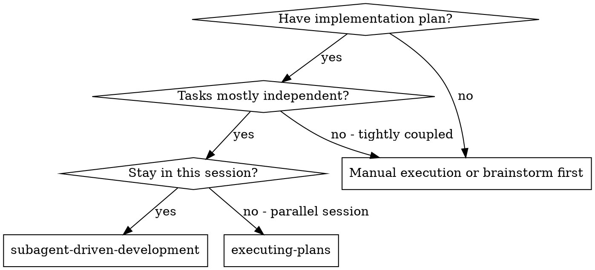
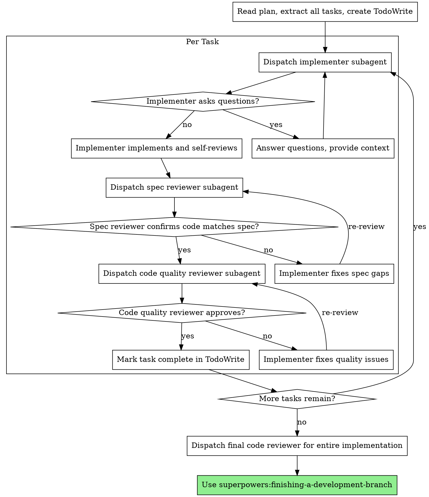

# Subagent-Driven Development

Execute plan by dispatching fresh subagent per task, with two-stage review after each: spec compliance review first, then code quality review.

**Core principle:** Fresh subagent per task + two-stage review (spec then quality) = high quality, fast iteration

## When to Use



## The Process



## Implementer Subagent Instructions

When dispatching implementer, include:

```markdown
## Task Context

You are implementing Task N of [total] for [project].

**Scene:** [Brief context about the project and where this task fits]

**Task:**
[Full task text from plan]

## Implementation Guidelines

1. **Implement the feature** as specified in the task
2. **Add tests** for critical paths and public APIs (follow pragmatic-testing principles)
3. **Commit** with descriptive message
4. **Self-review** before reporting back

## Testing Expectations

Apply pragmatic-testing judgment:
- Public APIs: Tests required
- Core logic: Tests required  
- Internal helpers: Tests optional
- Exploratory code: Tests can be deferred

Do NOT rigidly follow test-first methodology. Implement, then test what matters.

## Self-Review Checklist

Before reporting back:
- [ ] Code compiles without errors
- [ ] Implementation matches task specification
- [ ] Tests exist for critical paths (or documented deferral reason)
- [ ] If tests exist, they pass
- [ ] Code is reasonably clean

## Questions

If anything is unclear, ASK before implementing. Questions are welcome.

## Report Format

When done, report:
- What you implemented
- What tests you added (or why deferred)
- Any concerns or edge cases noted
- Files changed
```

## Spec Reviewer Instructions

```markdown
## Spec Compliance Review

You are reviewing Task N implementation against its specification.

**Task Specification:**
[Full task text from plan]

**Your job:** Verify implementation MATCHES the spec. Not more, not less.

## Review Checklist

- [ ] All requirements from spec are implemented
- [ ] No extra unrequested features added (YAGNI)
- [ ] Edge cases mentioned in spec are handled
- [ ] Implementation approach matches spec if one was specified

## Verdict

Reply with:
- ✅ APPROVED: Spec compliance confirmed
- ❌ ISSUES: [List specific gaps between spec and implementation]

Be specific. "Looks good" is not acceptable. Cite spec requirements.
```

## Code Quality Reviewer Instructions

```markdown
## Code Quality Review

You are reviewing Task N for code quality AFTER spec compliance passed.

**Focus on:**
- Clean, readable code
- Appropriate test coverage for critical paths
- No obvious bugs or issues
- Reasonable error handling

**Do NOT re-review spec compliance.** That already passed.

## Verdict

Reply with:
- ✅ APPROVED: Code quality acceptable
- ❌ ISSUES (Critical): [Must fix before proceeding]
- ⚠️ ISSUES (Minor): [Note for future, can proceed]
```

## Example Flow

```
[Controller reads plan, extracts tasks]
Controller: Task 1 of 5 - Add user authentication endpoint

[Dispatch implementer]
Implementer: Implemented auth endpoint, added tests for login/logout flows, committed.

[Dispatch spec reviewer]
Spec reviewer: ✅ APPROVED - All auth requirements implemented per spec.

[Dispatch code quality reviewer]  
Code reviewer: ⚠️ Minor: Consider extracting token validation to helper. ✅ APPROVED to proceed.

[Mark Task 1 complete, move to Task 2]
...
```

## Advantages

**vs. Manual execution:**
- Fresh context per task (no confusion)
- Subagent can ask questions before work
- Parallel-safe (subagents don't interfere)

**vs. Executing Plans:**
- Same session (no handoff)
- Continuous progress
- Review checkpoints automatic

**Quality gates:**
- Self-review catches obvious issues
- Spec compliance prevents over/under-building
- Code quality ensures maintainability

## Red Flags

**Never:**
- Skip reviews (spec compliance OR code quality)
- Proceed with unfixed Critical issues
- Dispatch multiple implementation subagents in parallel
- Ignore subagent questions
- Start code quality review before spec compliance passes

**If subagent asks questions:**
- Answer clearly and completely
- Don't rush them into implementation

**If reviewer finds issues:**
- Implementer fixes them
- Reviewer reviews again
- Repeat until approved

## Integration

**Required workflow skills:**
- **superpowers:writing-plans** — Creates the plan this skill executes
- **superpowers:requesting-code-review** — Code review template
- **superpowers:finishing-a-development-branch** — Complete after all tasks

**Subagents should follow:**
- **pragmatic-testing** — Context-appropriate testing (NOT rigid TDD)

**Alternative workflow:**
- **superpowers:executing-plans** — For parallel session with human checkpoints
