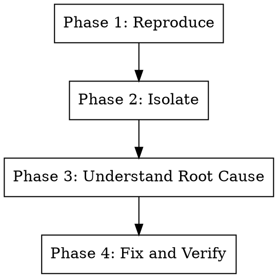

# Systematic Debugging

## Overview

Find and fix the actual cause, not the symptom.

**Core principle:** Understand WHY before fixing WHAT.

**Announce at start:** "I'm using the systematic-debugging skill to investigate this issue."

## The 4-Phase Process



### Phase 1: Reproduce

**Goal:** Consistently trigger the bug.

1. Gather symptoms: error messages, stack traces, logs
2. Identify minimal reproduction steps
3. Confirm bug reproduces reliably

**If can't reproduce:**
- Check environment differences
- Look for race conditions or timing dependencies
- Add logging to narrow down occurrence

### Phase 2: Isolate

**Goal:** Narrow down the location.

1. **Binary search the codebase:**
   - Which module/file?
   - Which function?
   - Which line(s)?

2. **Bisect if needed:**
   - When did it start failing?
   - What changed between working and broken?

3. **Simplify:**
   - Remove unrelated code
   - Create minimal reproduction case

### Phase 3: Understand Root Cause

**Goal:** Know exactly WHY it fails, not just WHERE.

**Questions to answer:**
- What is the incorrect assumption in the code?
- What input or state triggers the failure?
- Why did this ever work (if it did)?

**Techniques (see bundled references):**
- **root-cause-tracing.md** — Trace execution backward from failure
- **defense-in-depth.md** — Add validation at multiple layers
- **condition-based-waiting.md** — Replace arbitrary timeouts

**Do NOT proceed to fix until you can explain:**
```
"The bug occurs because [specific cause], which happens when [trigger condition]."
```

### Phase 4: Fix and Verify

**Goal:** Correct the root cause and prevent recurrence.

1. **Implement the fix** addressing root cause (not symptoms)

2. **Verify manually:**
   - Reproduction case no longer fails
   - Related functionality still works

3. **Add regression test (recommended, not mandatory):**
   - Test proves the fix works
   - Test would catch recurrence
   - Skip if fix is trivial or test would be low-value

4. **Review for similar issues:**
   - Could this bug exist elsewhere?
   - Should defensive code be added?

## Decision: When to Add a Regression Test

```
MUST add test:
├─ Bug was in public API
├─ Bug caused data corruption
├─ Bug was security-related
├─ Bug took significant time to debug
└─ Bug was reported by users

CAN skip test:
├─ Fix is trivial (typo, obvious error)
├─ Bug was in experimental code
├─ Test would be fragile/low-value
└─ Code area is being rewritten soon
```

## Anti-Patterns

| Anti-Pattern | Problem | Correct Approach |
|--------------|---------|------------------|
| "Add a try-catch" | Hides bug, doesn't fix it | Find and fix root cause |
| "Increase timeout" | Masks timing issue | Use condition-based waiting |
| "It works now, ship it" | Bug will return | Understand why it works |
| "Add null check everywhere" | Defensive noise | Fix why null appears |
| "Revert and try again" | Loses information | Investigate first |

## Bundled Techniques

### root-cause-tracing.md

Trace execution backward from the failure point:

1. Start at the error/crash location
2. Identify the immediate cause (bad value, null, etc.)
3. Ask: "Where did this bad state come from?"
4. Repeat until you find the original mistake

### defense-in-depth.md

Add validation at multiple layers:

1. **Input validation** — Catch bad data early
2. **Invariant checks** — Assert expected state
3. **Output validation** — Verify results make sense

Use when a single check point isn't sufficient.

### condition-based-waiting.md

Replace arbitrary sleeps/timeouts with condition polling:

```python
# Bad: arbitrary timeout
time.sleep(5)
assert result is not None

# Good: condition-based waiting
await eventually(lambda: result is not None, timeout=5.0)
```

See bundled `condition-based-waiting-example.ts` for implementation.

## Integration

**This skill pairs with:**
- **pragmatic-testing** — For deciding when regression tests add value
- **verification-before-completion** — Ensure fix is actually complete

**Dispatch parallel agents when:**
- Multiple independent bugs (use superpowers:dispatching-parallel-agents)
- Each agent gets one bug domain

## Red Flags

**Never:**
- Apply a fix you can't explain
- Skip Phase 3 (understanding root cause)
- Declare "fixed" without manual verification
- Add defensive code instead of fixing the bug

**Always:**
- Understand WHY before fixing
- Verify the fix manually
- Consider regression test (decide based on value)
- Check for similar issues elsewhere

## Quick Reference

| Phase | Goal | Output |
|-------|------|--------|
| 1. Reproduce | Consistent trigger | Reproduction steps |
| 2. Isolate | Narrow location | Specific file/function/line |
| 3. Understand | Know root cause | "Bug occurs because X when Y" |
| 4. Fix & Verify | Correct and protect | Working code + optional test |
